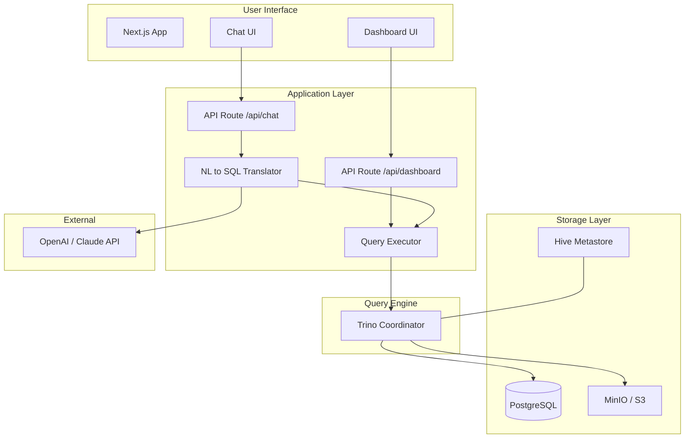

# Data Lake Platform Design

**Spec**: `.specs/features/01-data-lake-platform/spec.md`
**Status**: Draft

---

## Architecture Overview

O data lake usa **Trino** como query engine federado, capaz de consultar simultaneamente o PostgreSQL (dados transacionais ao vivo) e arquivos Parquet no MinIO (dados históricos). A aplicação Next.js expõe um chat que traduz perguntas em linguagem natural para SQL via API OpenAI/Claude e executa as queries no Trino.



## Data Flow

```
1. User types question in Chat UI
2. API route receives question
3. NL → SQL translator (OpenAI) converts to Trino SQL
   - Uses schema context (tables, columns, relationships)
   - Validates SQL safety (read-only queries only)
4. Query Executor sends SQL to Trino via HTTP API
5. Trino plans and executes federated query:
   - Reads from PostgreSQL (live sales, products, stores)
   - Reads from MinIO/Hive (historical sales, aggregations in Parquet)
   - Joins, filters, aggregates
6. Result returned to API route
7. API formats result as natural language response
8. Chat UI displays answer
```

## Container Architecture (Docker Compose)

```
┌─────────────────────────────────────────────────┐
│                  Docker Network                  │
│                                                  │
│  ┌──────────┐  ┌──────────┐  ┌───────────────┐ │
│  │PostgreSQL│  │  MinIO   │  │Hive Metastore │ │
│  │   :5432  │  │ :9000/01 │  │    :9083      │ │
│  └────┬─────┘  └────┬─────┘  └───────┬───────┘ │
│       │              │                │          │
│       └──────────────┼────────────────┘          │
│                      │                           │
│               ┌──────┴──────┐                    │
│               │    Trino    │                    │
│               │    :8080    │                    │
│               └──────┬──────┘                    │
│                      │                           │
│               ┌──────┴──────┐                    │
│               │   Next.js   │                    │
│               │    :3000    │                    │
│               └─────────────┘                    │
└─────────────────────────────────────────────────┘
```

## Code Reuse Analysis

### Existing Components to Leverage

Projeto greenfield — sem código existente. Utilizaremos:

| Component              | Location                          | How to Use                     |
| ---------------------- | --------------------------------- | ------------------------------ |
| trino-client           | npm package                      | Node.js Trino HTTP connector   |
| @aws-sdk/client-s3     | npm package                      | MinIO S3-compatible API        |
| openai                 | npm package                      | NL → SQL translation           |
| shadcn/ui              | npm package                      | UI components (Chat, Charts)   |
| @faker-js/faker        | npm package                      | Synthetic data generation      |
| recharts               | npm package                      | Dashboard charts               |

### Integration Points

| System         | Integration Method                          |
| -------------- | ------------------------------------------- |
| Trino          | HTTP REST API (`trino-client` npm package)  |
| PostgreSQL     | Via Trino PostgreSQL catalog connector      |
| MinIO          | Via Trino Hive connector (Parquet files)    |
| OpenAI         | `openai` npm SDK, chat completions endpoint |
| Hive Metastore | Thrift protocol (Trino auto-connects)       |

---

## Components

### Data Generator (`data-generator/`)

- **Purpose**: Gera dados sintéticos realistas de vendas de sucos e popula PostgreSQL + MinIO
- **Location**: `data-generator/src/`
- **Interfaces**:
  - `generateProducts(): Product[]` — gera 20+ sabores de suco
  - `generateStores(): Store[]` — gera 50+ lojas em 5 regiões
  - `generateSales(startDate, endDate): Sale[]` — gera vendas diárias com sazonalidade
  - `loadToPostgres(products, stores, sales): void` — insere no PostgreSQL
  - `exportToMinIO(sales, path): void` — exporta Parquet para MinIO
- **Dependencies**: `@faker-js/faker`, `pg` (PostgreSQL client), `@aws-sdk/client-s3`, `duckdb` (para escrever Parquet)
- **Reuses**: N/A (greenfield)

### Chat API Route (`web/src/app/api/chat/route.ts`)

- **Purpose**: Recebe pergunta do usuário, traduz para SQL, executa no Trino, retorna resposta
- **Location**: `web/src/app/api/chat/`
- **Interfaces**:
  - `POST /api/chat { question: string, history?: Message[] }` → `{ answer: string, sql?: string, data?: any }`
- **Dependencies**: `trino-client`, `openai`, `@/lib/trino`, `@/lib/nl-to-sql`
- **Reuses**: N/A

### Dashboard API Route (`web/src/app/api/dashboard/route.ts`)

- **Purpose**: Retorna KPIs agregados para o dashboard
- **Location**: `web/src/app/api/dashboard/`
- **Interfaces**:
  - `GET /api/dashboard` → `{ currentMonthSales, previousMonthSales, topProducts, salesByRegion, monthlyTrend }`
- **Dependencies**: `trino-client`, `@/lib/trino`
- **Reuses**: N/A

### Trino Client (`web/src/lib/trino.ts`)

- **Purpose**: Wrapper do Trino client para execução de queries
- **Location**: `web/src/lib/trino.ts`
- **Interfaces**:
  - `executeQuery(sql: string): Promise<QueryResult>` — executa query e retorna colunas + rows
- **Dependencies**: `trino-client`
- **Reuses**: N/A

### NL to SQL (`web/src/lib/nl-to-sql.ts`)

- **Purpose**: Converte linguagem natural para SQL usando OpenAI
- **Location**: `web/src/lib/nl-to-sql.ts`
- **Interfaces**:
  - `translateToSQL(question: string, schema: string, history: Message[]): Promise<string>` — retorna SQL
  - `getSchemaContext(): string` — retorna schema do data lake para o prompt
- **Dependencies**: `openai`
- **Reuses**: N/A

### Chat UI (`web/src/components/chat.tsx`)

- **Purpose**: Interface de chat com histórico de conversa
- **Location**: `web/src/components/chat.tsx`
- **Interfaces**: React component com props: `onSend(question: string): Promise<void>`
- **Dependencies**: shadcn/ui (Input, Button, ScrollArea, Card)
- **Reuses**: N/A

### Dashboard UI (`web/src/components/dashboard.tsx`)

- **Purpose**: Exibe KPIs com gráficos
- **Location**: `web/src/components/dashboard.tsx`
- **Interfaces**: React component — auto-fetch no mount
- **Dependencies**: recharts, shadcn/ui (Card, Skeleton)
- **Reuses**: N/A

---

## Data Models

### PostgreSQL (Transactional)

```sql
CREATE TABLE products (
  id          SERIAL PRIMARY KEY,
  name        VARCHAR(100) NOT NULL,
  category    VARCHAR(50) NOT NULL,  -- 'citrico', 'tropical', 'tradicional', 'premium', 'light'
  flavor      VARCHAR(50) NOT NULL,
  size_ml     INTEGER NOT NULL,      -- 200, 350, 500, 1000
  cost_price  DECIMAL(10,2),         -- custo de produção
  sell_price  DECIMAL(10,2),         -- preço de venda
  created_at  TIMESTAMP DEFAULT NOW()
);

CREATE TABLE stores (
  id          SERIAL PRIMARY KEY,
  name        VARCHAR(100) NOT NULL,
  city        VARCHAR(100) NOT NULL,
  state       CHAR(2) NOT NULL,
  region      VARCHAR(20) NOT NULL,  -- 'Norte', 'Nordeste', 'Centro-Oeste', 'Sudeste', 'Sul'
  type        VARCHAR(20) NOT NULL,  -- 'supermarket', 'convenience', 'wholesale'
  opened_at   DATE NOT NULL
);

CREATE TABLE sales (
  id              SERIAL PRIMARY KEY,
  product_id      INTEGER REFERENCES products(id),
  store_id        INTEGER REFERENCES stores(id),
  quantity        INTEGER NOT NULL,
  unit_price      DECIMAL(10,2) NOT NULL,  -- preço real de venda (pode variar)
  total_amount    DECIMAL(12,2) GENERATED ALWAYS AS (quantity * unit_price) STORED,
  sale_date       DATE NOT NULL,
  created_at      TIMESTAMP DEFAULT NOW()
);

CREATE INDEX idx_sales_date ON sales(sale_date);
CREATE INDEX idx_sales_product ON sales(product_id);
CREATE INDEX idx_sales_store ON sales(store_id);
```

### MinIO / Hive (Data Lake — Parquet)

Os mesmos dados são exportados periodicamente para o MinIO em formato Parquet, particionados por ano/mês:

```
s3://datalake/
  sales/
    year=2024/
      month=01/
        sales_202401.parquet
      month=02/
        sales_202402.parquet
      ...
    year=2025/
      ...
  products/
    products.parquet
  stores/
    stores.parquet
  daily_aggregations/
    year=2024/
      month=01/
        daily_sales_202401.parquet
```

---

## Error Handling Strategy

| Error Scenario                      | Handling                                               | User Impact                                |
| ----------------------------------- | ------------------------------------------------------ | ------------------------------------------ |
| Trino connection timeout            | Retry 2x com exponential backoff, then error           | "Data lake temporariamente indisponível"   |
| SQL generation fails (OpenAI)       | Fallback: tenta reformular prompt, max 3 tentativas    | "Não consegui traduzir sua pergunta"        |
| Query retorna vazio                 | Resposta: "Nenhum dado encontrado para este período"   | Mensagem informativa                       |
| OpenAI API key missing              | Trino queries diretas sem NL translation               | Chat desabilitado, dashboard funciona      |
| MinIO unreachable                   | Query executa apenas no PostgreSQL (degraded)          | Resposta parcial, avisa usuário            |
| Invalid SQL attempt (DDL/DML)       | Bloqueia query, loga tentativa                         | "Apenas consultas de leitura são permitidas" |

---

## Tech Decisions

| Decision                                         | Choice                                 | Rationale                                                       |
| ------------------------------------------------ | -------------------------------------- | --------------------------------------------------------------- |
| Query engine                                     | Trino (via trino-client npm)           | Federated queries nativas, padrão enterprise                    |
| Parquet writer                                   | DuckDB (data generator)                | Leve, escreve Parquet sem Spark, embutido no Node.js            |
| NL → SQL                                         | OpenAI GPT-4o / GPT-4o-mini            | Melhor custo-benefício para tradução SQL                        |
| Frontend charts                                  | Recharts                               | Leve, React-native, boa customização                            |
| Metastore                                        | Hive Metastore standalone              | Necessário para Trino catalogar Parquet no MinIO                |
| Deploy Railway — data lake                       | PostgreSQL only + DuckDB embedded      | MinIO/Trino pesados para Railway free tier; DuckDB resolve      |
| Parquet em vez de CSV/JSON                       | Parquet                                | Compressão 5-10x, colunar, padrão data lakes reais              |
